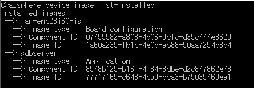
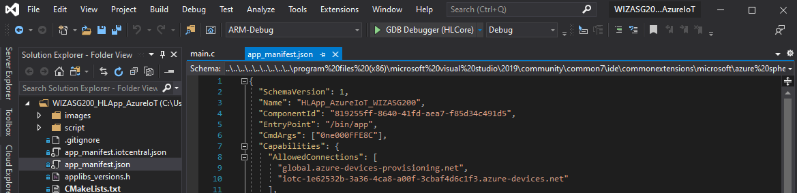
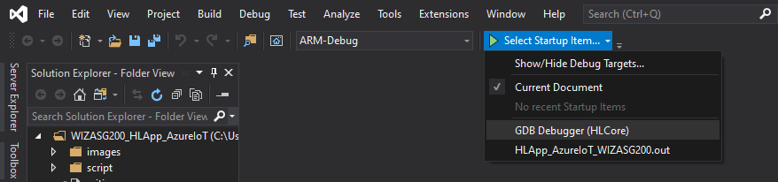

# ASG200 User Guide

WIZnet Azure Sphere Guardian 200 (ASG200) is a product which provides Ethernet interfaces to both Public and Private Network. This is how to set up ASG200 for data communication between your device and Azure IoT Cloud with ASG200.


# Contents

- [Azure Sphere Development Environment](#azure-sphere-development-environment)

  - [Machine Environment](#machine-environment)
  - [Azure Sphere SDK Installation](#azure-sphere-sdk-installation)
  - [Azure Sphere Debuger](#azure-sphere-debuger)

- [Development Environment](#development-environment)

  - [Azure Sphere CLI](#azure-sphere-cli)
  - [Register User Account](#register-user-account)
  - [Azure Sphere Tenant](#azure-sphere-tenant)
  - [ASG200 Claim](#asg200-claim)
  - [ASG200 Configuration](#asg200-configuration)

- [Run Application](#run-application)
  - [Real-time capable Application: W5500 SPI BareMetal](#real-time-capable-application:-w5500-spi-baremetal)
  - [High-level Application: AzureIoT](#high-level-application:-azureiot)
  - [Configure an IoT Hub](#configure-an-iot-hub)
  - [Set up Public Ethernet interface](#set-up-public-ethernet-interface)
  - [Build and Run the Application](#build-and-run-the-application)

---

# Azure Sphere Development Environment

complete the below steps to develop applications with Azure Sphere on a Windows or Linux system

## Machine Environment

You can select Azure Sphere development kit for your machine and install software.

- On Windows 10 (1st anniversary update or more)
  - Visual Studio Enterprise, Professional or Community 2019
  - Visual Studio Code
- On Linux
  - Visual Studio Code

## Azure Sphere SDK Installation

Download Azure Sphere SDK and install it.

- [Download Azure Sphere SDK](https://aka.ms/AzureSphereSDKDownload)

Then complete Azure Sphere SDK Extension Install for development tool.

- [For Visual Studio, Azure Sphere SDK Extension Install](https://docs.microsoft.com/ko-kr/azure-sphere/install/development-environment-windows#develop-with-visual-studio)
- [For Visual Studio, Azure Sphere SDK Extension Install](https://docs.microsoft.com/ko-kr/azure-sphere/install/development-environment-windows#develop-with-visual-studio-code)

## Azure Sphere Debuger

The MT3620 exposes two dedicated UARTs and SWD interface for debugging. The Azure Sphere PC software tools require the use of a USB-to-UART interface that exposes these interfaces to a PC in away that allows the tools to recognize and interact with them.
For this, ASG200 components has ‘Debugger’ board which can attaches to 18pin headers on ASG200. To use this debugger board, user should init the interface information with FTDI tools.

Please follow these steps decribed in this link:

- [FTDI FT_PROG programming tool](https://docs.microsoft.com/ko-kr/azure-sphere/hardware/mt3620-mcu-program-debug-interface#ftdi-ft_prog-programming-tool)

# Development Environment

## Azure Sphere CLI

The azsphere.exe command-line utility supports commands that manage Azure Sphere elements.
For the more details, enter the below link:

- [azsphere command-line utility](https://docs.microsoft.com/en-us/azure-sphere/reference/overview)

On Azure Sphere Developer Command Prompt Preview, the option, -?, helps to show the command information.


## Register User Account

To manage Azure Sphere elements for development, log in Azure Sphere Developer Command Prompt Preview with Microsoft account. To use Azure Sphere Security Service, Microsoft Account is required.

1.  Log in on ‘azsphere login’ command
    (Needed the option, –-newuser, with ‘azsphere login’ command to register the account only have to sign in once.)

        ```
        azsphere login --newuser <MS account>
        ```

## Azure Sphere Tenant

An Azure Sphere tenant provides a secure way for your organization to remotely manage its Azure Sphere devices in isolation from other customer’s devices. And it is accessed based on RBAC (Role Based Access Control). Only people with an account in that directory will be able to manage devices within your Azure Sphere tenant.

### Role assigned an account in the Azure Sphere tenant

Follow these steps to select the role assigned Azure Sphere tenant:

1. Search the tenant list.

   ```
   azsphere tenant list
   ```

2. Select the tenant from the list with tenant id.

   ```
   azsphere tenant select -i <tenant id>
   ```

3. Check the selected tenant.
   ```
   azsphere tenant show-selected
   ```

### Create new tenant

There is no existed Azure Sphere tenant or assigned role in it. User can create new Azure Sphere tenant.

1. Create new tenant
   ```
   azsphere tenant create -n <tenant name>
   ```

## ASG200 Claim

Check the selected tenant for development environment. Once ASG200 claimed to the Azure Sphere tenant, claiming to other tenant is prohibited followed Azure Sphere Security policy.

1. Claim ASG200 to the selected tenant

   ```
   azsphere device claim
   ```

## ASG200 Configuration

### Recovery interface

Once ASG200 is connected to the internet, Azure Sphere OS updates are initiated automatically via OTA (Over The Air) Wi-Fi interface. Also, user can manually update Azure Sphere OS with recovery. Recovery is the process of replacing the latest system software on the device using a special recovery bootloader instead of cloud update.

Follow these steps to update the latest Azure Sphere OS:

1. Set Wi-Fi interface

   ```
   azsphere device wifi add –ssid <SSID> --psk <Password>
   ```

2. Check Wi-Fi Status

   ```
   azsphere device wifi show-status
   ```

3. Recovery for Azure Sphere OS update

   ```
   azsphere device recover
   ```

4. Check Azure Sphere OS version

   ```
   azsphere device show-os-version
   ```

### Development Mode

Connect Debugger board which is attached to ASG200 debug interface to PC and set development mode for debugging on In Azure Sphere Developer Command Prompt Preview. On development mode, OTA is inactivated.

1. Development mode for debugging

   ```
   azsphere device enable-development
   ```

2. Add option for RT App debugging

   ```
   azsphere device enable-development --enablertcoredebugging
   ```

# Run Application

For ASG200 application, chapter 5, Development Environment, is preceded.
ASG200 application has two types of applications, High-level application and Real-time capable application.

## Real-time capable Application: W5500 SPI BareMetal

Real-time (RT) capable application run on bare metal or with a real-time operating system on the real-time cores.
In ASG200, RTApp (Real-time capable Application) is ‘RTApp_W5500_SPI_BareMetal_WIZASG200’ and it controls WIZnet W5500 ethernet chip and provides variety protocol communications with legacy devices on brown field. Also, it performs inter-core communication between RTApp and HLApp (High-level Application).

RTApp_W5500_SPI_BareMetal_WIZASG200 is performed as the followed:

- WIZnet W5500 SPI control
  - Local network communication with brown field
  - Ethernet interface
  - TCP Server for data communication with brown field
  - DHCP Server for local network address configuration of brown field
  - SNTP Server for time information management
- Inter-core communication
  - Send the parsing data from brown field to HLApp

## High-level Application: AzureIoT

High-level (HL) application run containerized on the Azure Sphere OS. In ASG200, HLApp (High-level application) is ‘HLApp_AzureIoT_WIZASG200’ and it provides whole functions for Azure IoT Cloud service. Also, it automatically switches global interface, Ethernet and Wi-Fi, for network condition.

HLApp_AzureIoT_WIZASG200 is performed as the followed:

- Global network communication with Azure IoT Cloud service
  - Ethernet and Wi-Fi interface
  - Connection and Authentication on IoT Hub or IoT Central
- Inter-core communication
  - Receive the data from RTApp for sending to Azure IoT Cloud

## Configure an IoT Hub

To operate ASG200 application, RTApp and HLApp, Azure IoT Hub or IoT Central configuration is required.

[Set up an Azure IoT Hub for Azure Sphere](https://docs.microsoft.com/en-us/azure-sphere/app-development/setup-iot-hub)

[Set up an Azure IoT Central to work with Azure Sphere](https://docs.microsoft.com/en-us/azure-sphere/app-development/setup-iot-central)

Then, user will need to supply the following information in the app_manifest.json file for Azure IoT:

- The Tenant ID for ASG200
- The Scope ID for Azure device provisioning service (DPS) instance
- The Azure IoT Hub URL for user IoT Hub or Central along with the global access link to DPS (global.azure-devices.provisiong.net)

In app_manifest.json, add Azure DPS Scope ID, Azure IoT Hub endpoint URL and Azure Sphere Tenant ID from Azure IoT Hub or Central into the following lines:

```
{
  "SchemaVersion": 1,
  "Name": "HLApp_AzureIoT_WIZASG200",
  "ComponentId": "819255ff-8640-41fd-aea7-f85d34c491d5",
  "EntryPoint": "/bin/app",
  "CmdArgs": ["<Azure DPS Scope ID>"],
  "Capabilities": {
    "AllowedConnections": [
      "global.azure-devices-provisioning.net",
      "<Azure IoT Hub endpoint URL>"
    ],
    "DeviceAuthentication": "<Azure Sphere Tenant ID>",
    "AllowedApplicationConnections": ["005180bc-402f-4cb3-a662-72937dbcde47"],
    "Gpio": [
      "$WIZNET_ASG200_CONNECTION_STATUS_LED",
      "$WIZNET_ASG200_WLAN_STATUS_LED",
      "$WIZNET_ASG200_ETH0_STATUS_LED",
      "$WIZNET_ASG200_ETH1_STATUS_LED"
    ],
    "NetworkConfig": true,
    "WifiConfig": true
  },
  "ApplicationType": "Default"
}
```

## Set up Public Ethernet interface

To enable ethernet interface for public network and communication with Azure IoT, install ethernet imagepackage by deploying a board configuration image to ASG200. The board configuration image contains information that the Azure Sphere Security Service requires to add support for Ethernet to the Azure Sphere OS.

Follow these steps to enable public ethernet interface:

1. Create a board configuration image package

   ```
   azsphere image-package pack-board-config –-preset lan-enc28j60-isu0-int5 –-output enc28j60-isu0-int5.imagepackage
   ```

2. Prepare ASG200 for development mode

   ```
   azsphere device enable-development
   ```

3. Sideload a board configuration image package

   ```
   azsphere device sideload deploy -–imagepackage enc29j60-isu0-int5.imagepackage
   ```

4. Check the sideloaded imagepackage

   ```
   azsphere device image list-installed
   ```



## Build and Run the Application

The application can be run and developed with Visual Studio and Visual Studio Code.

### Run with Visual Studio

Follow these steps to build and run the application with Visual Studio:

1. Start Visual Studio, From the File menu, select Open > Folder… and navigate to the folder, ‘HLApp_AzureIoT_ASG200’.

2. Open app_manifest.json file and check the information correct.



3. From the Select Startup Item menu, on the tool bar, select GDB Debugger (HLCore).



4. Click Build>Build All to build the project


5. Press F5 to start the application with debugging.

### Run with Visual Studio Code

Follow these steps to build and run the application with Visual Studio Code:

1. Open ‘HLApp_AzureIoT_ASG200’ folder.


2. Press F7 to build the project

3. Press F5 to start the application with debugging
