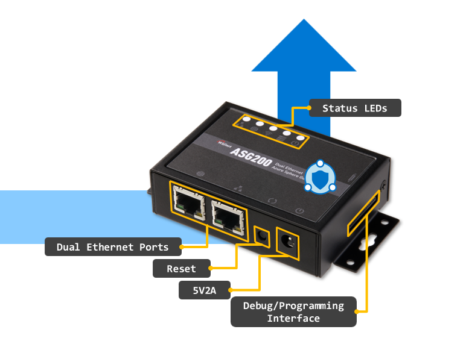

# ASG200 User Guide

WIZnet Azure Sphere Guardian 200 (ASG200) is a product which provides Ethernet interfaces to both Public and Private Network. This is how to set up ASG200 for data communication between your device and Azure IoT Cloud with ASG200.



# Contents

- [Azure Sphere Development Environment](#azure-sphere-development-environment)

  - [Machine Environment](#machine-environment)
  - [Azure Sphere SDK Installation](#azure-sphere-sdk-installation)
  - [Azure Sphere Debuger](#azure-sphere-debuger)

- [Development Environment](#development-environment)

  - [Azure Sphere CLI](#azure-sphere-cli)
  - [Register User Account](#register-user-account)
  - [Azure Sphere Tenant](#azure-sphere-tenant)
  - [ASG200 Claim](#asg200-claim)
  - [ASG200 Configuration](#asg200-configuration)

- [Run Application](#run-application)
  - [Real-time capable Application: W5500 SPI BareMetal](#real-time-capable-application-w5500-spi-baremetal)
  - [High-level Application: AzureIoT](#high-level-application-azureiot)

---

# Azure Sphere Development Environment

complete the below steps to develop applications with Azure Sphere on a Windows or Linux system

## Machine Environment

You can select Azure Sphere development kit for your machine and install software.

- On Windows 10 (1st anniversary update or more)
  - Visual Studio Enterprise, Professional or Community 2019
  - Visual Studio Code
- On Linux
  - Visual Studio Code

## Azure Sphere SDK Installation

Download Azure Sphere SDK and install it.

- [Download Azure Sphere SDK](https://aka.ms/AzureSphereSDKDownload)

Then complete Azure Sphere SDK Extension Install for development tool.

- [For Visual Studio, Azure Sphere SDK Extension Install](https://docs.microsoft.com/ko-kr/azure-sphere/install/development-environment-windows#develop-with-visual-studio)
- [For Visual Studio, Azure Sphere SDK Extension Install](https://docs.microsoft.com/ko-kr/azure-sphere/install/development-environment-windows#develop-with-visual-studio-code)

## Azure Sphere Debugger

The MT3620 exposes two dedicated UARTs and SWD interface for debugging. The Azure Sphere PC software tools require the use of a USB-to-UART interface that exposes these interfaces to a PC in away that allows the tools to recognize and interact with them.
For this, ASG200 components have a ‘Debugger’ board which can attaches to 18pin headers on ASG200. To use this debugger board, user should init the interface information with FTDI tools.

Please follow these steps described in this link:

- [FTDI FT_PROG programming tool](https://docs.microsoft.com/ko-kr/azure-sphere/hardware/mt3620-mcu-program-debug-interface#ftdi-ft_prog-programming-tool)

# Development Environment

## Azure Sphere CLI

The azsphere.exe command-line utility supports commands that manage Azure Sphere elements.
For the more details, enter the below link:

- [azsphere command-line utility](https://docs.microsoft.com/en-us/azure-sphere/reference/overview)

On Azure Sphere Developer Command Prompt Preview, the option, -?, helps to show the command information.


## Register User Account

To manage Azure Sphere elements for development, log in Azure Sphere Developer Command Prompt Preview with Microsoft account. To use Azure Sphere Security Service, Microsoft Account is required.

1.  Log in on ‘azsphere login’ command
    (Needed the option, –-newuser, with ‘azsphere login’ command to register the account only have to sign in once.)

        ```
        azsphere login --newuser <MS account>
        ```

## Azure Sphere Tenant

An Azure Sphere tenant provides a secure way for your organization to remotely manage its Azure Sphere devices in isolation from other customer’s devices. And it is accessed based on RBAC (Role Based Access Control). Only people with an account in that directory will be able to manage devices within your Azure Sphere tenant.

### Role assigned an account in the Azure Sphere tenant

Follow these steps to select the role assigned Azure Sphere tenant:

1. Search the tenant list.

   ```
   azsphere tenant list
   ```

2. Select the tenant from the list with tenant id.

   ```
   azsphere tenant select -i <tenant id>
   ```

3. Check the selected tenant.
   ```
   azsphere tenant show-selected
   ```

### Create new tenant

There is no existed Azure Sphere tenant or assigned role in it. User can create new Azure Sphere tenant.

1. Create new tenant
   ```
   azsphere tenant create -n <tenant name>
   ```

## ASG200 Claim

Check the selected tenant for development environment. Once ASG200 claimed to the Azure Sphere tenant, claiming to other tenant is prohibited followed Azure Sphere Security policy.

1. Claim ASG200 to the selected tenant

   ```
   azsphere device claim
   ```

## ASG200 Configuration

### Recovery interface

Once ASG200 is connected to the internet, Azure Sphere OS updates are initiated automatically via OTA (Over The Air) Wi-Fi interface. Also, user can manually update Azure Sphere OS with recovery. Recovery is the process of replacing the latest system software on the device using a special recovery bootloader instead of cloud update.

Follow these steps to update the latest Azure Sphere OS:

1. Set Wi-Fi interface

   ```
   azsphere device wifi add –ssid <SSID> --psk <Password>
   ```

2. Check Wi-Fi Status

   ```
   azsphere device wifi show-status
   ```

3. Recovery for Azure Sphere OS update

   ```
   azsphere device recover
   ```

4. Check Azure Sphere OS version

   ```
   azsphere device show-os-version
   ```

### Development Mode

Connect Debugger board which is attached to ASG200 debug interface to PC and set development mode for debugging on In Azure Sphere Developer Command Prompt Preview. 

On development mode, OTA is inactivated.

1. Development mode for debugging

   ```
   azsphere device enable-development
   ```

2. Add option for RT App debugging

   ```
   azsphere device enable-development --enablertcoredebugging
   ```

# Run Application

For the ASG200 application, chapter 5, Development Environment, is preceded.

ASG200 application has two types of applications, High-level application and Real-time capable application.

## Real-time capable Application: W5500 SPI BareMetal

* [Run Real-time capable Application: W5500 SPI BareMetal](https://github.com/WIZnet-Azure-Sphere/ASG200_App/tree/master/Software/WIZASG200_RTApp_W5500_SPI_BareMetal)

## High-level Application: AzureIoT

* [Run High-level Application: AzureIoT](https://github.com/WIZnet-Azure-Sphere/ASG200_App/tree/master/Software/WIZASG200_HLApp_AzureIoT)