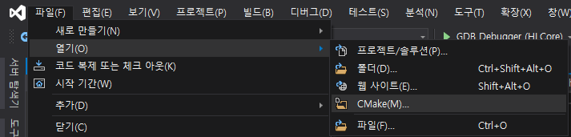

- [WIZASG200 AzureIoT](#wizasg200-azureiot)
  - [이더넷 사용 설정 (Public ethernet)](#%ec%9d%b4%eb%8d%94%eb%84%b7-%ec%82%ac%ec%9a%a9-%ec%84%a4%ec%a0%95-public-ethernet)
  - [app_manifest.json 설정](#appmanifestjson-%ec%84%a4%ec%a0%95)
  - [Run with Visual Studio](#run-with-visual-studio)
  - [Run with VSCode](#run-with-vscode)
- [Sample: AzureIoT](#sample-azureiot)
  - [Prerequisites](#prerequisites)
  - [Preparation](#preparation)
  - [Run the sample](#run-the-sample)


# WIZASG200 AzureIoT

WIZASG(Azure Sphere Guardian) 2 port ethernet module Application

>어플리케이션을 실행하기 전에 Azure Sphere 설정이 선행되어야 한다.
>* [Setup Azure Sphere using CLI](https://github.com/Wiznet-OpenHardware/AzureSphereDev#setup-azure-sphere)


**어플리케이션 동작**
* 네트워크(Ethernet and WiFi) 초기화
* Azure DPS를 통해 IoT Hub 접속
* 데이터 송수신
  * `SIMUL_DATA` 설정 시, simulated temperature data를 보냄
  * 그렇지 않을 경우 W5500 소켓 오픈 후 데이터 수신 대기
    * 소켓 수신 데이터를 IoT Hub로 보냄


## 이더넷 사용 설정 (Public ethernet)

>참조: [Azure Sphere에서 이더넷에 연결](https://docs.microsoft.com/ko-kr/azure-sphere/network/connect-ethernet)

* 이더넷 인터페이스를 사용하려면 애플리케이션 이미지 외에 보드 구성 이미지(board configuration image)가 필요하다.
* 보드 구성 이미지는 Azure Sphere OS에 대한 이더넷 지원을 추가하기 위해 Azure Sphere Security Service에 필요한 정보를 포함하고 있다.

- Preset 설정으로부터 보드 구성 이미지 패키지 생성
  
  `azsphere image-package pack-board-config --preset lan-enc28j60-isu0-int5 --output enc28j60-isu0-int5.imagepackage`

- 이미지 패키지 로드
  
  `azsphere device sideload deploy --imagepackage enc28j60-isu0-int5.imagepackage`

- lan-enc28j60 패키지 로드 확인
  
  `azsphere device image list-installed`
   ```
   Installed images:
   --> lan-enc28j60-is
      --> Image type:   Board configuration
      --> Component ID: 40617f6c-2bcc-4335-bdd8-e24a8fde61a8
      --> Image ID:     ba11ad7d-7315-4f0c-a8bf-1bcc567bf465
   --> gdbserver
      --> Image type:   Application
      --> Component ID: 8548b129-b16f-4f84-8dbe-d2c847862e78
      --> Image ID:     2eac78bb-c68c-4aa3-9849-9c82d65d9406
   ```

## app_manifest.json 설정

>아래 정보들은 private 값이므로 공개 배포 시에는 제거하도록 한다.

* DeviceAuthentication: Tenant ID
  * 연결된 디바이스와 클레임 된 tenant ID
  * `azsphere tenant show-selected` 명령으로 확인
* CmdArgs: Azure device provisioning service(DPS)의 Scope ID
* Capabilities - AllowedConnections: Azure IoT Hub의 endpoint URL
  * Global access link는 그대로 유지 (global.azure-devices.provisioning.net)


>**Application은 프로젝트 단위로 열어야 한다. (최상위 경로에 CMakeLists.txt 파일 포함)**

## Run with Visual Studio

### Open project

* 파일 -> 열기 -> 폴더 -> 프로젝트 폴더 선택

또는,
* 파일 -> 열기 -> CMake -> 프로젝트 폴더 내 CMakeLists.txt 선택 




### Build and run

* 상단 메뉴 아래의 `시작 항목 선택`에서 **GDB Debugger (HLCore)** 선택
* 메뉴 - 빌드 - 모두 빌드
* <kbd>**F5**</kbd>키를 누르거나, 선택된 **GDB Debugger (HLCore)** 버튼을 클릭하여 디버그 시작
  * 어플리케이션 빌드
  * 이미지 패키지 생성
  * 보드에 배포


## Run with VSCode

### Open project

프로젝트 폴더 오픈

### Build and run

* <kbd>**F7**</kbd>을 눌러 빌드
* <kbd>**F5**</kbd>를 눌러 디버그 시작
  * 어플리케이션 빌드
  * 이미지 패키지 생성
  * 보드에 배포


### 환경 설정

>아래에서 설정하는 경로는 `Visual Studio용 Azure Sphere SDK`를 사용할 때 기준이다.

`파일 - 기본 설정 - 설정` 또는, 단축키 <kbd>**Ctrl**</kbd>+<kbd>**,**</kbd>를 입력하여 **settings.json** 오픈

>UI 설정 화면으로 열릴 경우, 우측 상단의 `설정 열기(JSON)`을 클릭하여 파일을 오픈한다.

CMake와 Azure Sphere 경로 설정 추가


```
"cmake.cmakePath": "C:\\Program Files (x86)\\Microsoft Visual Studio\\2019\\Community\\Common7\\IDE\\CommonExtensions\\Microsoft\\CMake\\CMake\\bin\\cmake.exe",
"cmake.configureSettings": {
   "CMAKE_MAKE_PROGRAM": "C:\\Program Files (x86)\\Microsoft Visual Studio\\2019\\Community\\Common7\\IDE\\CommonExtensions\\Microsoft\\CMake\\Ninja\\ninja.exe",
},
"AzureSphere.ArmGnuPath": "C:\\Program Files (x86)\\Microsoft Visual Studio\\2019\\Community\\Linux\\gcc_arm\\bin",
"AzureSphere.SdkPath": "C:\\Program Files (x86)\\Microsoft Azure Sphere SDK",
```

### 빌드 및 실행

* <kbd>**F7**</kbd>키를 눌러 빌드
* <kbd>**F5**</kbd>키를 눌러 프로젝트 디버그
  * 어플리케이션 빌드
  * 이미지 패키지 생성
  * 보드에 배포


----
----
(Original README)

# Sample: AzureIoT

This sample demonstrates how to use the Azure IoT SDK C APIs in an Azure Sphere application to communicate with Azure IoT Central or Azure IoT Hub. 

**IMPORTANT**: This sample application requires customization before it will compile and run. Follow the instructions in this README and in IoTCentral.md and/or IoTHub.md to perform the necessary steps.

This application does the following:

- Sends simulated temperature telemetry to Azure IoT Central or an Azure IoT Hub at regular intervals.
- Sends a button-press event to Azure IoT Central or an Azure IoT Hub when you press button A on the MT3620 development board.
- Sends simulated orientation state to Azure IoT Central or an Azure IoT Hub when you press button B on the MT3620 development board.
- Controls one of the LEDs on the MT3620 development board when you change a toggle setting on Azure IoT Central or edit the device twin on Azure IoT Hub.

Before you can run the sample, you must configure either an Azure IoT Central application or an Azure IoT Hub, and modify the sample's application manifest to enable it to connect to the Azure IoT resources that you configured.

By default, this sample runs over a Wi-Fi connection to the internet. To use Ethernet instead, make the following changes:

1. Configure Azure Sphere as described in [Connect Azure Sphere to Ethernet](https://docs.microsoft.com/azure-sphere/network/connect-ethernet).
1. Add an Ethernet adapter to your hardware. If you are using an MT3620 RDB, see the [wiring instructions](../../Hardware/mt3620_rdb/EthernetWiring.md).
1. Add the following line to the Capabilities section of the app_manifest.json file:

   `"NetworkConfig" : true`

1. In main.c, add the following lines before any other networking calls:

    ```c
     int err = Networking_SetInterfaceState("eth0", true);
     if (err < 0) {
           Log_Debug("Error setting interface state %d\n",errno);
           return -1;
       }
    ```

1. In the Project Properties, set the Target API Set to 4.

The sample uses these Azure Sphere application libraries.

| Library                                                                                                                     | Purpose                                                                       |
| --------------------------------------------------------------------------------------------------------------------------- | ----------------------------------------------------------------------------- |
| log                                                                                                                         | Displays messages in the Visual Studio Device Output window during debugging  |
| networking                                                                                                                  | Determines whether the device is connected to the internet                    |
| gpio                                                                                                                        | Manages buttons A and B and LED 4 on the device                               |
| storage                                                                                                                     | Gets the path to the certificate file that is used to authenticate the server |
| [EventLoop](https://docs.microsoft.com/en-gb/azure-sphere/reference/applibs-reference/applibs-eventloop/eventloop-overview) | Invoke handlers for timer events                                              |

## Prerequisites

The sample requires the following software:

- Azure Sphere SDK version 20.01 or later. At the command prompt, run **azsphere show-version** to check. Install [the Azure Sphere SDK](https://docs.microsoft.com/azure-sphere/install/install-sdk) if necessary.
- An Azure subscription. If your organization does not already have one, you can set up a [free trial subscription](https://azure.microsoft.com/free/?v=17.15).

## Preparation

**Note:** By default, this sample targets [MT3620 reference development board (RDB)](https://docs.microsoft.com/azure-sphere/hardware/mt3620-reference-board-design) hardware, such as the MT3620 development kit from Seeed Studios. To build the sample for different Azure Sphere hardware, change the Target Hardware Definition Directory in the project properties. For detailed instructions, see the [README file in the Hardware folder](../../Hardware/README.md). 

1. Set up your Azure Sphere device and development environment as described in the [Azure Sphere documentation](https://docs.microsoft.com/azure-sphere/install/overview).
1. Clone the Azure Sphere Samples repository on GitHub and navigate to the AzureIoT folder.
1. Connect your Azure Sphere device to your computer by USB.
1. Enable a network interface on your Azure Sphere device and verify that it is connected to the internet.
1. Open an Azure Sphere Developer Command Prompt and enable application development on your device if you have not already done so:

   `azsphere device enable-development`

## Run the sample

- [Run the sample with Azure IoT Central](./IoTCentral.md)
- [Run the sample with an Azure IoT Hub](./IoTHub.md)
