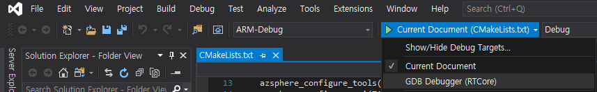
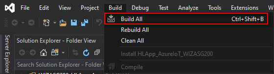
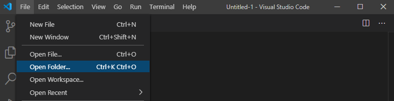

# WIZASG200_RTApp_W5500_SPI_BareMetal

Real-time (RT) capable application run on bare metal or with a real-time operating system on the real-time cores.
In ASG200, RTApp (Real-time capable Application) is `RTApp_W5500_SPI_BareMetal_WIZASG200` and it controls WIZnet W5500 ethernet chip and provides variety protocol communications with legacy devices on brown field. Also, it performs inter-core communication between RTApp and HLApp (High-level Application).

`RTApp_W5500_SPI_BareMetal_WIZASG200` is performed as the followed:

- WIZnet W5500 SPI control
  - Local network communication with brown field
  - Ethernet interface
  - TCP Server for data communication with brown field
  - DHCP Server for local network address configuration of brown field
  - SNTP Server for time information management
- Inter-core communication
  - Send the parsing data from brown field to HLApp

## Build and Run the Application

The application can be run and developed with Visual Studio and Visual Studio Code.

### Run with Visual Studio

Follow these steps to build and run the application with Visual Studio:

1. Start Visual Studio, From the File menu, select `Open` > `Folder…` and navigate to the folder, `WIZASG200_RTApp_W5500_SPI_BareMetal`.

2. From the Select Startup Item menu, on the tool bar, select `GDB Debugger (RTCore)`.

4. Click `Build` > `Build All` to build the project

5. Press F5 to start the application with debugging.

### Run with Visual Studio Code

Follow these steps to build and run the application with Visual Studio Code:

1. Open `WIZASG200_RTApp_W5500_SPI_BareMetal` folder.

2. Press F7 to build the project

3. Press F5 to start the application with debugging
